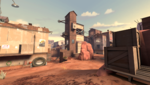
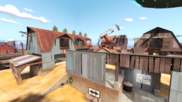

# Three Musket - Game Design Document

## Game Summary
   
   This game is a team deathmatch multiplayer 3V3 first-person shooter.

   The game will be action and strategy focused, fast-paced, and gameplay driven with less focus on story and characters.
   We plan to assign general roles to each character such tank, DPS, and support that varies in their weaponry and playstyle.
   The map will have walls, obstacles, and possibly vehicles as well as unique objectives to win the game.

   Communication between players will be a critical aspect of the game.
   Collaboration will be rewarded while preserving the possibility for one player to carry the game.
   An unique aspect of the game is the timeout mechanic where players are able to pause the game, similar to basketball, and discuss strategy and change their setups.

   The game will be initially developed for a single player before expanding to multiplayer, adding bots to fill the role of the opposing team.

## Genre
   
   Multiplayer FPS

## Inspiration
   
   Our inspiration is multiplayer FPS games with unique weapons such as CS:GO or Team Fortress 2.

   ### CS:GO

   Specifically, we are looking at Wingman and Deathmatch modes in CS:GO.
   We will further refine our team deathmatch game style with adding unique objectives to win the game.

   https://blog.counter-strike.net/index.php/about/

   ### Team Fortress 2

   We are inspired by the 8 roles in Team Fortress 2 - Scout, Soldier, Pyro, Demoman, Heavy, Engineer, Medic, Sniper, Spy.
   We plan to implement a simpler role system with unique weaponry and playstyles for each role.

   https://wiki.teamfortress.com/wiki/Team_Fortress_2

   We are also inspired by the maps in Team Fortress 2.

   
   
   
   These sand texture maps will best use the graphics capabilities of jMonkeyEngine.

   ### Future Development

   For future development, we plan to add elements of strategy and teamwork, inspired by games like Deadlock and Spectre Divide.
   
## Gameplay
   
   * Projectile-heavy weaponry
     * Instead of hitscan, projectiles are used for most weapons
     * Overall low utility options (smoke, flash, grenade, etc.)
     * Hitscan weapons and utility options will be highly valuable
   * 3 roles with different weapon builds for each (builds can be changed during timeout)
     * Tank: choose from additional health and utility options
       * shield and supportive play / mobility and engagement
     * DPS: choose from long range and melee
       * long range for hitscan / melee for flanking
     * Support: choose from debuff and healing
       * debuff for aggressive engage / heal for supporting and stability
   * Timeouts (3 times per game)
     * each team can timeout in the middle of the battle to setup and edit their strats
   * Single player mode
     * Bots to fill the role of the opposing team
   * Future development: Co-op or 1V1 modes
     * RTS style FPS (consider Chess, Starcraft, or AOS)

## Developement

   * First Deliverable
     * We have coded a crosshair, a gun shooting mechanism with collision detection, and some targets. The player is also able to jump and move around the map.
        * 
     * We use a scene graph were targets and bullets are nodes and when collided, the bullet disappears and the node also gets pruned.
     * For input we use addMapping on the WASD keys for 2D movement and spacebar for jumping. We use left click to listen for shooting.
     * For the crosshair we use a guiNode and use local translation to calculate the location for the middle of the screen.

   * Second Deliverable
     * Since the first deliverable, we have added animated meshes for the gun. Now, instead of bullets appearing out of thin air, there is a visible gun barrel with lighting effects.
        * 
        * After the first bullet is fired, the barrel mesh transitions to a full view of two hands holding the gun, complete with recoil animation.
           *
     * In addition to the weapon updates, we have added textures to the targets, shown in the images above.
     * We have incorporated various lighting techniques such as AmbientLight and DirectionalLight to enhance realism. Notably, a shadow effect simulates the player's body or head casting a shadow over the gun, adding to the immersive experience.
     * Additionally, we have included a health bar to indicate the remaining health of targets. Currently the health bar only reflects a singular target, with a plan to add one on top of each target in the future.
        * 
     * Finally, we retained features like jumping, gravity, and collision mechanics to allow the player to navigate the game effectively.

   * Third Deliverable
     * Since the second deliverable, we have added several environmental and atmospheric effects to enhance the game's visual and audio experience:
        * We implemented a dynamic fog system with two styles:
           * Desert style: Light beige fog (ColorRGBA(0.9f, 0.9f, 0.9f)) with moderate density
           * 

           * Forest style: Greenish fog (ColorRGBA(0.6f, 0.8f, 0.7f)) with atmospheric depth
           * Forest Texture with and without Fog:
           * 
           * 

        * Added a comprehensive shadow system:
           * DirectionalLightShadowRenderer for realistic shadow casting
           * Configurable shadow modes for different objects (CastAndReceive, Receive)
           * Enhanced depth perception and realism
           * 

        * Implemented dynamic skybox:
           * Forest-themed skybox using six-sided cube mapping
           * Desert-themed alternative skybox option
           * Seamless integration with fog effects (see fog section)
        
        * Included Particles (burst) when the bullet successfully shoots the target
           * 

        * Created procedural terrain:
           * HillHeightMap-based terrain generation
           * Grass texture mapping with proper scaling
           * Physics-enabled terrain collision
           * 

        * Added realistic water effects:
           * Reflective water surface
           * Water physics and visual effects
           * Integration with lighting system
           * 

        * Implemented a comprehensive sound system:
        * 
           * Background music to add engrossment
           * Footstep sounds synchronized with player movement
           * Weapon firing sound effect whenever bullet is shot

        * Controls to enhance gaming experience:
           *  r to reload the gun
           *  p to terminate
           *  esc to pause the game and change modes
         
        * Other Additions:
           * The game is complete when the player has successfully destroyed ten targets, indicated by a message prompt.
           * 
           * Each target moves randomly to increase difficulty and interest
              * Now have their own health bar with a regen rate so players shoot consecutively at one target to destroy them effectively
              * 

     * The code for these features is organized into separate AppStates for modularity:
        * SkyandFog class handles atmospheric effects
        * ShadowManager manages shadow rendering
        * SceneAppState controls terrain generation
        * WaterAppState manages water effects
        * MusicAppState handles all audio features

     * All these features work together to create an immersive gaming environment while maintaining performance through efficient resource management and state control.

    * Fourth Deliverable
        * Added targets that shoot bullets at the player:
           * Targets now fire projectiles at regular intervals
           * Bullets deal damage to player on hit
           * Visual and sound effects for target shooting
        * Refined shadows and models:
           * Enhanced shadow quality and performance
           * Improved target and weapon models
           * Better visual feedback
        * Added game over functionality:
           * Player death triggers game over state
           * Option to restart or quit
           * Final score display
        * Future works:
           * Online multiplayer
           * More weapons
           * More maps

## Demo
[![Watch the video]https://youtu.be/iYRS-HmSSZU

  
## Member Contributions

* Kerry Wang
    * Textures, Lighting
    * SkyBox, Fog, Shadow, Particles
    * Health Bar, Target Removal, Collision Listener
* Yongjae Lee
    * Collision Detection, Targets
    * Textures, Lighting
    * Terrain, Water, Sound
* Jin Hong Moon
    * Textures, Lighting
    * Sound, Reload, GUI, Game modes
 
Due to scheduling constraints, we worked independently on different features of the game, with each team member focusing on specific aspects to enhance the overall experience. We coordinated by sharing our intended tasks, exchanging ideas, and occasionally working simultaneously while maintaining clear communication to avoid conflicts or unintended code modifications. Additionally, we ensured that our individual contributions and design decisions were reviewed and confirmed with other group members to keep everyone aligned and effectively contribute to the project.
